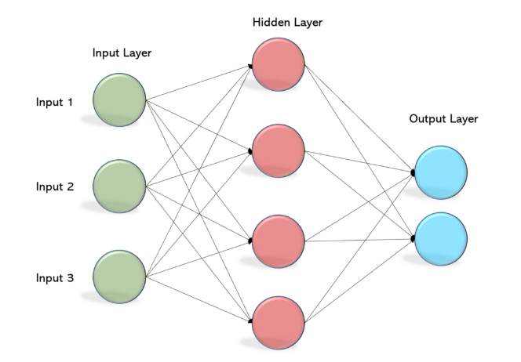
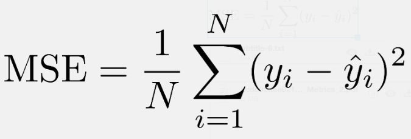
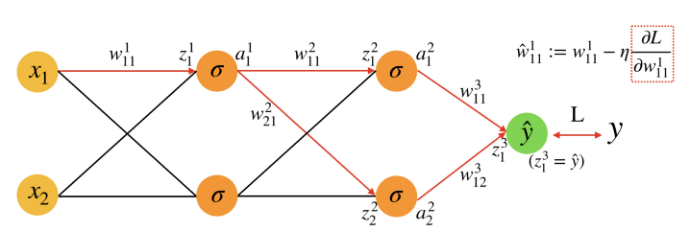

## **MLP WORK DEMO** #
***
This project using C to implement multilayer perceptron and using XOR data to test it.
## **Teachnics Description** #
***
This project use the MLP teachnics.Mltilayer perceptron(MLP) contains at least three layers,which is input layer, hidden layer and output layer,and uses the Backpropagation technology to update parameters in the network.The below figure shows the basic mlp structure.

In forward propagation,the idea of the project is first randomly allocate all the weights in the network,then in each layer,the output will go through an activation function (Sigmoid) and then passed to next layer as iuput.Sigmoid is shown below.

In output layer,the output is computed and compared to the ground truth data,and Mean Squared Error(MSE) is taken as loss function.And the loss will be smaller when the traning epoch is increased.

And the most complicated part is the Backpropagation,we use gradient(the red box in below figure) with certain learning rate to do gradient decent.

## **Demo Setup** #
1.&ensp;you can adjust layers through **int sizes[] = {}** part in the mlp.c,the default is **int sizes[] = {2,3,4,3,1}**

&emsp;Notes sizes[0] represents size of input layer,sizes[4] represents size of output layer,the other are hidden layes.

2.&ensp;gcc version : gcc 7.5.0
  
3.&ensp;run the code through this command: **gcc mlp.c -lm**,and the output file will be genrated in the same directory and named **a.out**

